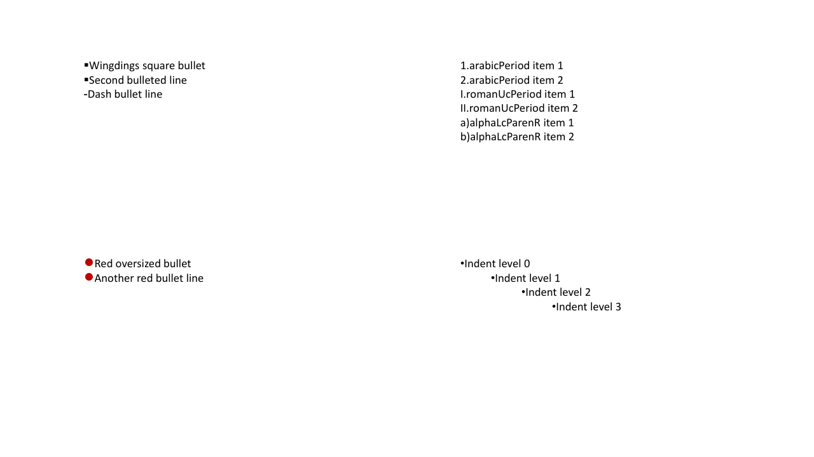

# Excudo

> *excūdō* (Latin): to hammer out; to forge.

[](https://github.com/dylantcon/excudo/actions/workflows/tests.yml)
[](LICENSE)

Excudo is a desktop presentation editor built from scratch in Java 21 and JavaFX. It reads and
writes PowerPoint's native OOXML format, renders it with an engine that is *measured* against
real PowerPoint output rather than eyeballed, and replaces the traditional in-memory undo stack
with a persistent, per-slide command graph. It is also built to be driven by an AI assistant:
the editor doubles as an MCP server, so a client like Claude Desktop can open, inspect, and
edit a live deck.

| Excudo's renderer | PowerPoint (ground truth) |
| :---: | :---: |
|  |  |
|  |  |

*Two slides from the parity corpus: gradient fills (top) and bullet/numbering styles (bottom),
rendered by Excudo on the left and rasterized from a PowerPoint-exported PDF on the right.*

## The interesting parts

### A renderer that is measured, not eyeballed

Claiming "renders PPTX" is easy. The hard part is knowing — honestly — how close you are.
`pc.py parity` maintains a corpus of ground-truth pairs (23 decks so far, one per feature
category): a PPTX built programmatically, and a PDF exported from it by an actual PowerPoint
installation. Every run renders each deck headlessly, rasterizes the PDF at matching resolution,
and scores every slide with SSIM plus foreground-histogram and IoU metrics into an HTML
side-by-side dashboard. Three checked-in control files keep the numbers from lying:

- **`thresholds.json`** — per-category SSIM floors a slide must meet to pass.
- **`baselines.json`** — best-ever metrics per slide. A ratchet: scores may only go up, and a
  regression fails the run.
- **`expected-failures.json`** — strict xfails. An "expected failure" that starts passing fails
  the build until the entry is removed, so known gaps can't quietly decay into ignored ones.

The renderer's text layout is calibrated against PowerPoint's own PDF output (line pitch,
autofit scaling steps, super/subscript geometry), and its geometry engine evaluates the
ECMA-376 guide formulas for all 187 preset shapes rather than approximating outlines with
hand-drawn paths. Color, fill, and text categories currently hold their
floors at 0.95+ SSIM; geometry, connectors, effects, and tables are the active fronts, tracked
as strict expected failures until they graduate.

### Undo that survives a restart

PowerPoint's undo is a stack in RAM — close the file and your history is gone. There was never
a fundamental reason for that limit, so Excudo drops it. A slide's layout is treated as the
origin of a directed acyclic graph of commands, and walking that graph reconstructs every state
the slide has been in. History becomes a property of the *document* rather than the session:
reopen a deck a week later and any slide can still be stepped back through its edits.

The synthesis engine also runs in reverse. Given an arbitrary slide it never saw being edited,
it diffs the slide against its layout and derives a command script that rebuilds it — and a
fixed-point test pins that synthesize → run → re-synthesize converges to the same script.

### An editor an LLM can drive

Excudo speaks the Model Context Protocol over both stdio and HTTP/SSE, exposing deck inspection
and editing as tools to any MCP client. It also hosts its own agentic loop with pluggable
backends (Anthropic API, Ollama, OpenRouter) and a tool dispatcher, so the conversation can
live inside the editor too. A Mermaid compiler (parser → AST → layout → OOXML emitter) turns
diagram source into native, editable slide shapes rather than pasted images.

### Its own build system

`pc.py` stands in for Maven/Gradle: pinned dependency fetching, staged incremental compilation,
parallel JUnit execution, JaCoCo coverage, OOXML compliance validation, and the parity harness,
all behind one CLI. CI runs the build and test suite on Linux, Windows, and macOS.

## Quick start

Requires Java 21 and Python 3.11+. (PowerPoint is only needed to *regenerate* parity ground
truth; the corpus ships with committed PDFs, so parity runs work anywhere.)

```console
python pc.py deps       # fetch pinned JARs, the JavaFX SDK, and fonts
python pc.py build
python pc.py run ui     # or: run console | run headless
```

For development:

```console
python pc.py test --parallel     # full JUnit suite
python pc.py parity run --open   # render the corpus, score against PowerPoint, open the dashboard
```

## Layout

| Path | What lives there |
| --- | --- |
| `src/main/java/com/excudo/core` | Document model, OOXML parsing, rendering, synthesis, geometry, text metrics |
| `src/main/java/com/excudo/view` | JavaFX UI |
| `src/main/java/com/excudo/console`, `cli` | Interactive console and headless automation |
| `src/main/java/com/excudo/mcp` | MCP server transports |
| `pc_cli/` | The Python build system and parity harness |
| `parity-corpus/` | Ground-truth decks and the honesty controls |

## License

[Business Source License 1.1](LICENSE): free for non-production use (personal study, academic
research, evaluation), converting to Apache 2.0 on April 7, 2030. Vendored third-party material
is documented in [docs/THIRD_PARTY.md](docs/THIRD_PARTY.md).
